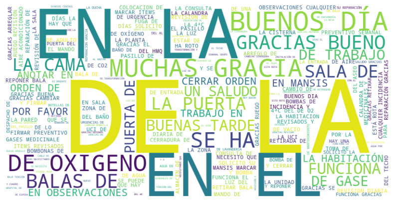
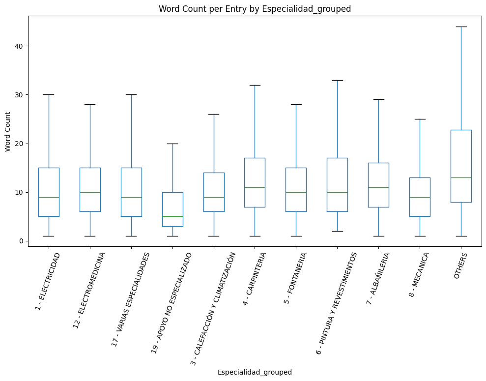
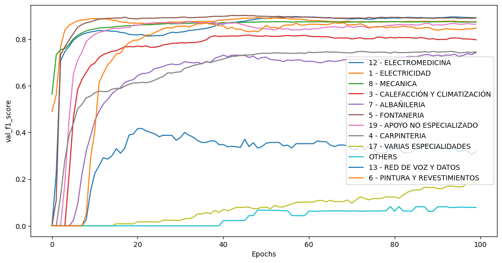
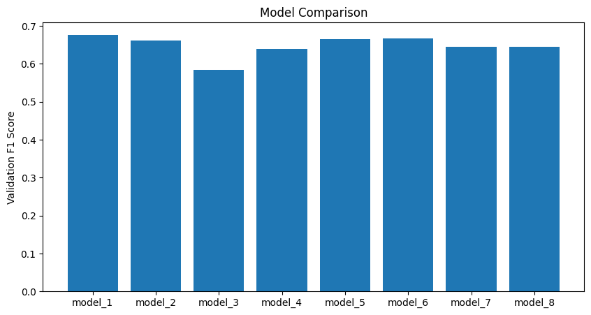
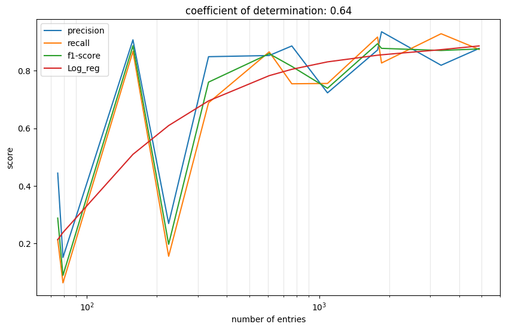
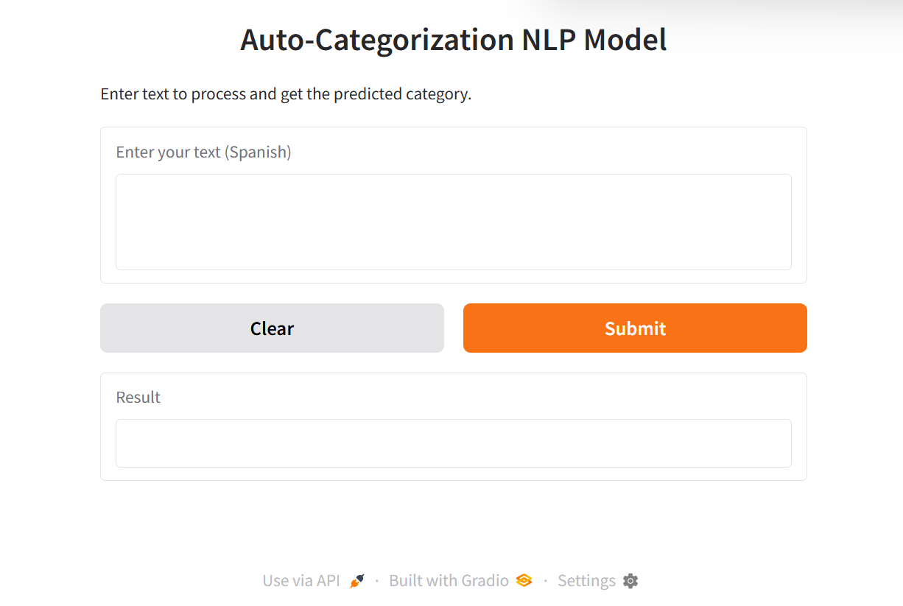

# 🤖 Machine Learning Project: Work Category Classifier 🚀
**🎯 Prediction of the work category based on the incidence description**
**🇪🇸 Spanish Language NLP Model**

---

## 📋 Table of Contents
1. #### [🔍 Project Overview](#-project-overview)
    - [🎯 Goal](#-goal)
    - [❓ Problem Statement](#-problem-statement)
    - [📊 Metrics](#-metrics)
    - [🛠️ Approach](#️-approach)
2. #### [📁 Data](#-data)
    - [📥 Data Collection](#-data-collection)
    - [🔬 Data Exploration (EDA)](#-data-exploration-eda)
3. #### [⚙️ Methodology](#️-methodology)
    - [🧹 Data Preprocessing](#-data-preprocessing)
    - [🔧 Feature Engineering](#-feature-engineering)
    - [🎲 Model Selection](#-model-selection)
    - [🏋️ Model Training](#️-model-training)
    - [📈 Model Evaluation](#-model-evaluation)
    - [🚀 Model Deployment](#-model-deployment)
4. #### [📊 Results](#-results)
5. #### [🎯 Conclusion & Future Work](#-conclusion--future-work)
6. #### [💾 Installation](#-installation)
7. #### [🖥️ Usage](#️-usage)

---

## 🔍 Project Overview

### 🎯 Goal
To predict technician work category using **Spanish NLP**, improving repairing/maintenance response time, eliminating workload and avoiding non-job-related learning for Spanish-speaking hospital staff.

### ❓ Problem Statement
Workers in the hospital send a repairing/maintenance request through a ticketing software. They have to specify the category of the maintenance technician to whom is intended (⚡ electrician, 🔧 mechanic, 🚰 plumber, 🪚 carpenter, etc.) but often the incidences are miscategorized because the healthcare personnel hasn't been trained for it. This situation leads to a slower response of the maintenance team and extra workload (and frustration) to the healthcare personnel that has to learn constantly who is in charge of every part of the equipment and building instead of performing their duties. The situation is compounded when new short term employees arrive.

### 📊 Metrics
Cause the number of incidences is different for every category (imbalanced classes), I opt for **Precision**, **Recall**, and **F1-Score** with Macro Average, so all the categories are treated equally. Confusion matrix is used for exploring.

### 🛠️ Approach
Starting collecting the data in the ticketing software. The field of interest are processed and prepared for training. Different model topologies are tested in the search for the best one. The final model is tested and evaluated, putting the focus on every class individually. Finally the model is deployed in HuggingFace and future improvements are discussed.

---

## 📁 Data

### 📥 Data Collection
All the data is provided by the ticketing software in **CSV format**. All the sensitive data is filtered before the request and just "Observation" and "Category" fields are used in this project. **The dataset contains incident descriptions written in Spanish** by hospital staff.

### 🔬 [Data Exploration (EDA)](notebooks/1_data_exploration.ipynb)
This stage is comprised of a visualization of how the data is stored in the csv file and decides what can and cannot be useful for the model. This will help us decide how to proceed in the subsequent stages. The csv file is open using pandas library.
```python
<class 'pandas.core.frame.DataFrame'>
RangeIndex: 75866 entries, 0 to 75865
Data columns (total 5 columns):
 #   Column         Non-Null Count  Dtype 
---  ------         --------------  ----- 
 0   Aviso          75866 non-null  object
 1   Fecha Aviso    75866 non-null  object
 2   Observaciones  75866 non-null  object
 3   Área           75866 non-null  object
 4   Especialidad   75866 non-null  object
dtypes: object(5)
memory usage: 2.9+ MB
```
The fields of interest are 'Observaciones' (ticket comment) and 'Especialidad' is the label field that define the class. The different classes and the number of entries for each one in the entire dataset is the next:
```python
Especialidad
8 - MECANICA                       24477
1 - ELECTRICIDAD                   16674
12 - ELECTROMEDICINA                9048
5 - FONTANERIA                      8910
4 - CARPINTERIA                     5318
3 - CALEFACCIÓN Y CLIMATIZACIÓN     3801
19 - APOYO NO ESPECIALIZADO         3089
7 - ALBAÑILERIA                     1704
17 - VARIAS ESPECIALIDADES          1140
6 - PINTURA Y REVESTIMIENTOS         891
13 - RED DE VOZ Y DATOS              379
16 - OFICINA TÉCNICA                 178
11 - ELECTRO-MECANICA                113
2 - OTROS SERVICIOS GENERALES         86
10 - TAPICERIA                        50
14 - LIMPIEZA                          4
18 - DDD                               3
9 - JARDINERIA                         1
Name: count, dtype: int64
```
Due to the lack of tickets created for some classes, those that don't pass a threshold of 300 entries are grouped in a single class call 'OTHERS'.
```python
Especialidad_grouped
8 - MECANICA                       24477
1 - ELECTRICIDAD                   16674
12 - ELECTROMEDICINA                9048
5 - FONTANERIA                      8910
4 - CARPINTERIA                     5318
3 - CALEFACCIÓN Y CLIMATIZACIÓN     3801
19 - APOYO NO ESPECIALIZADO         3089
7 - ALBAÑILERIA                     1704
17 - VARIAS ESPECIALIDADES          1140
6 - PINTURA Y REVESTIMIENTOS         891
OTHERS                               435
13 - RED DE VOZ Y DATOS              379
Name: count, dtype: int64
Total of unique categories =  12
```


---

## ⚙️ Methodology

### 🧹 [Data Preprocessing](notebooks/2_data_preprocessing.ipynb)
The data is prepared to be fed into the training stage, eliminating outliers, grouping small classes, cleaning the data if necessary, split into training and test dataset, vectorization and creating batches.



The dataset is divided between training and test so the model can be tested in unseen data and can be confirmed when the model reach overfitting or not.
```python
                                 Training  Test
Especialidad_groped                            
8 - MECANICA                        19607  4870
1 - ELECTRICIDAD                    13332  3342
12 - ELECTROMEDICINA                 7195  1853
5 - FONTANERIA                       7129  1781
4 - CARPINTERIA                      4233  1085
3 - CALEFACCIÓN Y CLIMATIZACIÓN      3039   762
19 - APOYO NO ESPECIALIZADO          2480   609
7 - ALBAÑILERIA                      1370   334
17 - VARIAS ESPECIALIDADES            915   225
6 - PINTURA Y REVESTIMIENTOS          733   158
OTHERS                                356    79
13 - RED DE VOZ Y DATOS               304    75
```
With training dataset the vocabulary dictionary is created and for a total of 22386 different words and limited later to 20000 more recurrent different ones. This is an example of vectorization result:
```python
text = "Se ha ido la luz en la cocina"
text_vectorized = vectorize_layer(text)
print(f"Vectorized text: {text_vectorized}")
__________________________________________________
Vectorized text: [ 10  24 696   3  35   4   3 155]
```
This vectorization is apply to all the text in the two datasets and the labels are one-hot encoded like so:
```python
Example label mapping: ('1 - ELECTRICIDAD', 1) -> [0. 1. 0. 0. 0. 0. 0. 0. 0. 0. 0. 0.]
```
Finally a shuffle buffer, prefetch and batch size are set along with cache for a faster and efficient training. All this tensors and settings are stored for the training stage to be used.

### 🎲 [Model Selection & Training](notebooks/3_model_training.ipynb)
To find the best model topology to predict between **12 different classes**. Starting with the most basic DNN until RNNs and CNNs, several models are tested and fine-tuned using validation results to choose the best performing model.



The different models are compared in the search for the best performing one.



After discerning for the best model, it's save for the evaluation stage and later for deployment in HuggingFace with Gradio.

### 📈 [Model Evaluation](notebooks/4_model_evaluation.ipynb)
To determine how the model performs to unseen data, putting attention to every specific class. Using **Confusion Matrix**, **Error Analysis** and **Regression** each class is tested and examined looking for anomalies in predictions, explaining the reason for the majority of misclassification. Finally it's proven how the size of each class in the dataset affects the model forecast.



With the help of Confusion Matrix the performance of the prediction for every class is discussed using Error Analysis.

```python

Detailed Classification Report:
============================================================
                                 precision    recall  f1-score   support

           12 - ELECTROMEDICINA       0.94      0.83      0.88      1853
               1 - ELECTRICIDAD       0.82      0.93      0.87      3342
                   8 - MECANICA       0.88      0.87      0.88      4870
3 - CALEFACCIÓN Y CLIMATIZACIÓN       0.89      0.75      0.82       762
                7 - ALBAÑILERIA       0.85      0.69      0.76       334
                 5 - FONTANERIA       0.87      0.92      0.89      1781
    19 - APOYO NO ESPECIALIZADO       0.85      0.87      0.86       609
                4 - CARPINTERIA       0.72      0.76      0.74      1085
     17 - VARIAS ESPECIALIDADES       0.27      0.16      0.20       225
                         OTHERS       0.15      0.06      0.09        79
        13 - RED DE VOZ Y DATOS       0.44      0.21      0.29        75
   6 - PINTURA Y REVESTIMIENTOS       0.91      0.87      0.89       158

                       accuracy                           0.85     15173
                      macro avg       0.72      0.66      0.68     15173
                   weighted avg       0.84      0.85      0.84     15173

```

### 🚀 [Model Deployment](https://huggingface.co/spaces/david-delpico-ml/ticketing)
The final model is deployed using **Gradio** in [🤗 HuggingFace](https://huggingface.co/spaces/david-delpico-ml/ticketing)

[](https://huggingface.co/spaces/david-delpico-ml/ticketing)
---

## 📊 Results

The final forecast of the model can be marked as a **✅ success**. The accuracy of the model is established at **85%**, reaching F1-Score of **89%** as highest in some classes and **0.09** the lowest. Some work in the model input and in the dataset should be necessary to sort the imprecision in three of the 12 classes. Lack of entries in certain categories and mixed work related fields are the reasons for the underperformance of those classes. The model could be used and implemented because exceeds the **80% accuracy** threshold so can be stated that the model learned.

---

## 🎯 Conclusion & Future Work

- ✅ Reaching an overall performance accuracy of **85%**, the resulting model can outperform the actual manual system where **20%** of the tickets are incorrectly labeled.
- 🔊 The model can be implemented along with a **TextToSpeech** system for consulting or call forwarding to the relevant team.
- 🎯 Create a **Multi-modal input system** to accept other available fields like location to be more accurate in the prediction.
- 🤖 Use **attention mechanism** within transformers.
- 🏷️ Allow **multi-classification** because sometimes more than one team is related to a ticket.

---

## 💾 Installation

```bash
# Clone the repository
git clone https://github.com/david-delpico-ml/ticketing-classifier.git

# Install dependencies
pip install -r requirements.txt
```

## 🖥️ Usage

```python
# Import the model
from src.features.predict import predict

# Initialize and predict (Spanish text input)
prediction = predict("La luz del quirófano no funciona correctamente")
print(f"🎯 Predicted category: {prediction}")
```

---

<div align="center">

### 🌟 **Made with ❤️ for better hospital maintenance workflows** 🌟

**⭐ Star this repo if you found it helpful!**

</div>
